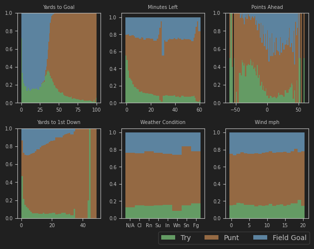
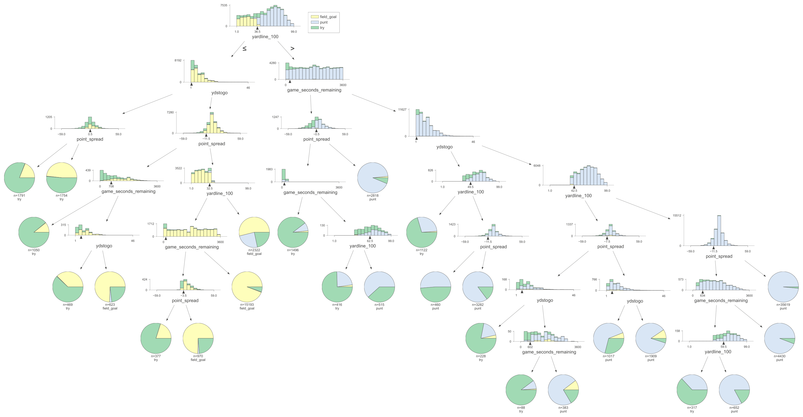

Frank Tucci CSC 466 \
Dr. Rwebangira

**Analysis of NFL 4th Down Decision Making**

**Explanation**

Football is a game carried out in a series of _drives,_ where the team in possession of the ball gets 4 attempts, or downs, to advance the ball 10 yards. If a team fails, they must give up possession to the opposing team. As a result, what a team decides to do on 4th down is uniquely risky, and can have a large importance on the outcome of the game. There are three types of plays a team can do on a 4th down:

* **Field Goal**: A team can choose to kick the football through the uprights in the opposite end zone, scoring 3 points.
* **Punt**: A team can choose to forfeit the ball, in exchange for kicking it farther down the field and making the opposing team farther from scoring a touchdown.
* **Try for 1st Down**: A team can try to advance the ball past the 1st down line. If this fails, the opposing team gets possession of the ball in the same position.

**Motivation**

Predicting what a play might be before it is carried out is of great importance to the defensive team, who can try to prepare their players for what they believe will be the most likely scenario. On the contrary, offensive teams can use what they believe is an uncommon play in an attempt to surprise the defensive team. This information is also useful for fans or announcers of a game to better understand when a play is out of the ordinary, and why, and for coaching staff to recognize changes in playstyle.

**Research**

The idea of this report was inspired by the football reporting done by John Bois. Specifically, their “Surrender Index” calculator uses features such as point spread and seconds left in game in order to categorize how safe or risky a team’s decision to punt is. Their explanation of the factors that influence a team’s decision to go for 1st down as opposed to punting were useful in the interpretation of the decision tree.

I also got inspired to look at how weather patterns influence team’s behavior from Ben Baldwin’s article _NFL fourth-down decisions: The math behind the league’s new aggressiveness_. They used a similar methodology for calculating the optimal outcomes for a 4th down play.

**Data**

Data was retrieved from the python library nfl_data_py, a collection of open source NFL box-office data which contains each play for every NFL game from the 1999 to the 2023 season. We will only be looking at 4th down decisions for this report, as any punt or field-goal outside of a 4th down is exceedingly rare.

<table>
  <tr>
   <td>Total Play-by-play Records
   </td>
   <td>1198382
   </td>
  </tr>
  <tr>
   <td>4th Downs
   </td>
   <td>104587
   </td>
  </tr>
  <tr>
   <td>Field Goals
   </td>
   <td>23375
   </td>
  </tr>
  <tr>
   <td>Punts
   </td>
   <td>61984
   </td>
  </tr>
  <tr>
   <td>Tries
   </td>
   <td>13768
   </td>
  </tr>
</table>

We will be looking at 6 features for every play-by-play record:

* **yardline_100:** The current position of the ball, recorded in yards to the opposing team’s end zone.
* **ydstogo:** The amount of yards that, if a team decides to continue the drive, they must make in order to reach 1st down.
* **game_seconds_remaining:** The amount of seconds until the end of the game.
* **point_spread:** The amount of points a team is leading by. If a team is in the lead, this will be a positive value. If a team is losing, this is will be a negative value. If tied, this value will be 0.
* **condition:** The current weather condition. This can be one of: "Indoors", "Sunny",  "Cloudy,  "Windy", “Fog”,  "Rain", "Snow". If no weather data was recorded, this will be “N/A”.
* **wind:** The wind speed in mph. Will be 0 for indoor stadiums and N/A for when data was not recorded.

**Feature Analysis**

This chart shows the proportions of field goals, punts, and tries while varying one feature per graph, indicated on the x axis. Some observations:

* Field goals make up the majority of all 4th down plays until 36 yards from goal. After this point, punts make up the majority of 4th down plays. It is increasingly difficult to kick a successful field goal the longer the kick is to make, and this 36 yard mark (when added to the 17 yards past the end zone where the uprights are) represent the upper bound to human kick ability. After this, the most likely scenario is to punt, which becomes increasingly effective the farther away a team is from the opposite end zone.
* Teams usually try to field goal close to the end of the 1st half, where they will not have time to complete the drive before halftime. Trying for 1st down becomes the most common 10 minutes before the end of the game.
* A team that is losing, especially by more than 3 points, will try to go for a 1st down much more often than a team that is winning.
* Teams will most commonly try for a 1st down when there is only 1 yard to go until 1st down.
* Weather and wind show no general trends, other than maybe a slight decrease in field goals made in extremely windy  conditions. Because variation is so low, we will not include this data in our analysis.

**Methodology**

Data was randomly sampled using a 80/20 Train/Test split. Values were normalized for both K means and K nearest neighbor, but not for decision tree, where it is unnecessary. The values in the tables are calculated based on pairs of points which were calculated to be in the same group, or in different groups.

**K Means Clustering**

<table>
  <tr>
   <td>True Positives
   </td>
   <td>162654756
   </td>
  </tr>
  <tr>
   <td>False Positives
   </td>
   <td>47887490
   </td>
  </tr>
  <tr>
   <td>False Negatives
   </td>
   <td>96804122
   </td>
  </tr>
  <tr>
   <td>True Negatives
   </td>
   <td>85704082
   </td>
  </tr>
  <tr>
   <td>Precision
   </td>
   <td>0.7725516331767449
   </td>
  </tr>
  <tr>
   <td>Recall
   </td>
   <td>0.6268999436588946
   </td>
  </tr>
  <tr>
   <td>F1
   </td>
   <td>0.6921462426119644
   </td>
  </tr>
</table>

K means was simply not very effective. One reason why the model failed to accurately capture the features was the fact that the three categories are each of different sizes. Punting happens a majority of the time, and k-means tendency to form equal-sized clusters meant that many punt data points were being included in the other two clusters. Secondly, the data does not have enough variance for the separate clusters to be distinct. Depending on the random starting locations of the algorithm, the clusters form in different locations every time.

**K Nearest Neighbor**

<table>
  <tr>
   <td>Accuracy
   </td>
   <td>0.910118026833451
   </td>
  </tr>
  <tr>
   <td>True Positives
   </td>
   <td>185862296
   </td>
  </tr>
  <tr>
   <td>False Positives
   </td>
   <td>24679950
   </td>
  </tr>
  <tr>
   <td>False Negatives
   </td>
   <td>14365038
   </td>
  </tr>
  <tr>
   <td>True Negatives
   </td>
   <td>168143166
   </td>
  </tr>
  <tr>
   <td>Precision
   </td>
   <td>0.8827791074291095
   </td>
  </tr>
  <tr>
   <td>Recall
   </td>
   <td>0.9282563588445921
   </td>
  </tr>
  <tr>
   <td>F1
   </td>
   <td>0.9049467392400381
   </td>
  </tr>
</table>

K nearest neighbor had a much greater effectiveness due to it not being so impacted by differences in category amounts. The optimal k value was found to be around 20.

**Decision Tree**

<table>
  <tr>
   <td>Accuracy
   </td>
   <td>0.9023000100877635
   </td>
  </tr>
  <tr>
   <td>True Positives
   </td>
   <td>186010400
   </td>
  </tr>
  <tr>
   <td>False Positives
   </td>
   <td>24531846
   </td>
  </tr>
  <tr>
   <td>False Negatives
   </td>
   <td>17288506
   </td>
  </tr>
  <tr>
   <td>True Negatives
   </td>
   <td>165219698
   </td>
  </tr>
  <tr>
   <td>Precision
   </td>
   <td>0.8834825482008015
   </td>
  </tr>
  <tr>
   <td>Recall
   </td>
   <td>0.9149601621565047
   </td>
  </tr>
  <tr>
   <td>F1
   </td>
   <td>0.8989458834678674
   </td>
  </tr>
</table>

Decision tree, while performing marginally worse than K nearest neighbors, was slightly more accurate in predicting when a team might try for a 1st down. The number of leaf nodes was capped at 25, as any additional nodes gave diminishing returns and made the tree harder to visualize. The amount of leaf nodes was capped, rather than tree depth, because some branches of the tree consisted of more uniform data than others. Unlike KNN, looking at the visualized decision tree gives interesting insight into the decision making that teams go through, beyond looking at any data point individually

**Decision Tree Analysis**

Expectedly, the decision tree finds that yards to goal is the most influential feature, dividing the decision tree between a field goal or try side on the left, and a punt or try side on the right. On the left, the tree identifies having a short number of yards to first, or a small amount of seconds left in the game, as reasons to try for 1st down instead of field goal. The graph identifies a -3.5 point spread, or being behind by more than a field goal, as the deciding factor at the end of the game between trying for 1st down or going for a field goal. On the right side, the graph identifies a -7.5 point spread, or being behind by more than a touchdown (with successful kick) as being the deciding factor between punting or going for a 1st down.

**Conclusion**

This study allowed me to learn more about the strengths and weaknesses of various models, and made me think more about decision making in sports. Having access to a decision tree like this may be useful for players, fans, and coaching staff to make more informed decisions. I was surprised to learn that weather does not have influence on play decisions, when I expected there to be. It would be interesting to consult experts who have a stronger knowledge of football for what should be some additional features, and see if that helps improve model accuracy. I think it would also be worthwhile, in the future, to do a similar model and decision tree using the same features to analyze whether or not a field goal attempt may be successful.

**Code**

The code for this project is available on github here: [https://github.com/franktucci/466-fourth-down-analysis](https://github.com/franktucci/466-fourth-down-analysis)

**Sources**

Bois, Jon. “The Search for the Saddest Punt in the World | Chart Party.” YouTube, YouTube, 19 Feb. 2019, [www.youtube.com/watch?v=F9H9LwGmc-0](www.youtube.com/watch?v=F9H9LwGmc-0). 

Baldwin, Ben. “NFL Fourth-down Aggressiveness.” _The Athletic_, [theathletic.com/2144214/2020/10/28/nfl-fourth-down-decisions-the-math-behind-the-leagues-new-aggressiveness/](theathletic.com/2144214/2020/10/28/nfl-fourth-down-decisions-the-math-behind-the-leagues-new-aggressiveness/). Accessed 29 Feb. 2024. 

Brill, Ryan S., et al. ‘Analytics, Have Some Humility: A Statistical View of Fourth-down Decision Making’. _arXiv [Stat.AP]_, 2023, [http://arxiv.org/abs/2311.03490](http://arxiv.org/abs/2311.03490). arXiv.
